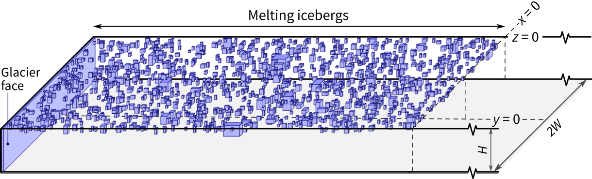

# An analytical model of fjord circulation induced by melting icebergs

The 'analytical model' described by Hughes (2023, submitted). This predicts the fjord circulation induced by melting icebergs in the configuration below. It also provides the simpler calculations laid out in the paper.



## Example usage

```python
# Setup
import numpy as np
from seawater.eos80 import pden
H = 600
zp1 = -np.linspace(0, H, 51)
z = (zp1[:-1] + zp1[1:])/2
L = 8e3
t = 7*86400
tau = 7*86400
x = 20e3
f = 1.37e-4
W = 2.5e3
yp1 = W*np.linspace(-1, 1, 51)
y = (yp1[:-1] + yp1[1:])/2
deltaS = 3
SR = 35 - deltaS*(1 + z/H)
TR = 2 + 0*z  # Let T denote theta
rhoR = pden(SR, TR, 0)
M = 2.5e-8*W*L*(1 + np.tanh((z+100)/25))
deltaA = M*tau
A0 = 2*W*L
SL = A0*SR/(A0 + deltaA)
T_eff = -85
TL = (A0*TR + deltaA*T_eff)/(A0 + deltaA)
rhoL = pden(SL, TL, 0)

# The actual calculation
U = melt_induced_circulation(rhoL, rhoR, t, x, z, y=y, L=L, tau=tau, f=f)

# Get total outflow
dy, dz = np.diff(yp1).mean(), np.diff(-zp1).mean()
Qout = np.sum(U[U > 0]*dy*dz)
print(f'Qout = {Qout.astype(int)} m^3/s')
```
